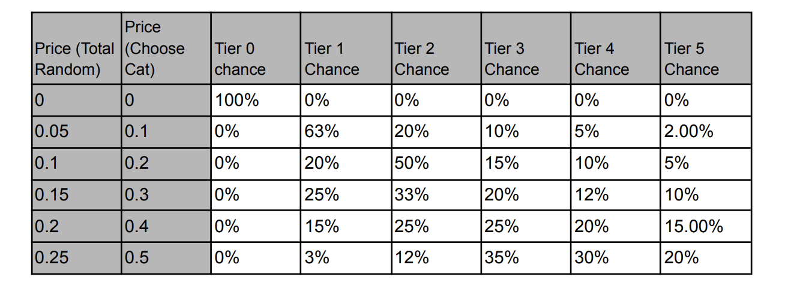

## Simple Summary
Illuvitars is a modular, configurable, NFT-based system for getting an avatar into the Illuvium
Universe. Each Illuvitar can be used across all games, as long as you link your account to
the wallet that owns the NFT.
The intention with Illuvitars is to allow for a perfect mix of randomness and rarity (via
configurable attributes that are interchangeable), and availability via high-quality base
portraits that anyone can purchase for a reasonable fee.

## Abstract
Create avatars for users in the Illuvium universe.

## Overview 

### Illuvitar Components

Each Illuvitar is composed of two distinct parts which combine together to make the final
image. This image can be made up of many NFTs as we allow one NFT component per
accessory category.

### Minting

Fans can mint an infinite number of random base layer Illuvitars. These will be sold for a
fixed price, with the ability to boost your chances of minting higher-tier Illuvitars by adding
an additional fee.

### Sets

Each set is available for a limited time. Once a new set is released the previous will never be
available for purchase again, unless from another user on the IlluviDEX.

### Base Illuvitars - set 1
TBD

### Base Illuvitar Pricing

### Accessory Types
* Head
* Eyes
* Body
* Mouth

### Accessory Pricing

Both sILV and ETH can be used and the final price is subject to approval from the council
before the sale date.
Illuvitars and accessories will be sold in the IlluviDEX and act as the first method by which
these base layers can be bought.

### Bonding
Once an accessory has been bonded to an Illuvitar it is permanent and can no longer be
removed.

### Badges
Badges from the Balancer Sale can also be fitted to an Illuvitar, however, these are not
bonded and can be removed at any time.

## Rationale
Illuvitars is a fun way of giving players their own unique identity in the Illuvium Universe. The
revenue generated from the sale will go into the Illuvium vault to be distributed to stakers in
the protocol.

## Test Cases
Crypto punks, Bored Ape Yacht Club, Cool Cats.
